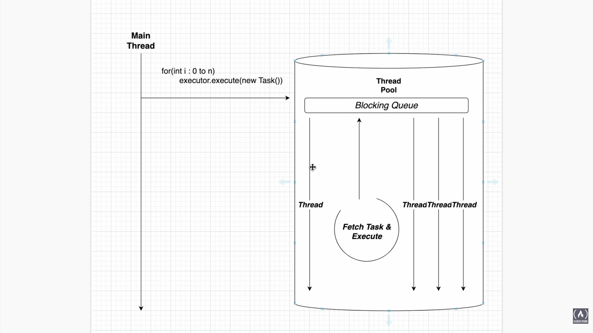

                Executor (interface)
                        │
                        ▼
              ExecutorService (interface) --- implemented by AbstractExecutorService and extended by two classes
                                                    ThreadPoolExecutor,ForkJoinPool
                        │
                        ▼
        ScheduledExecutorService (interface)


                        
            AbstractExecutorService
                        │
                        ▼
            
                ThreadPoolExecutor (class)
                        │
                        ▼
          ScheduledThreadPoolExecutor (class) implements ScheduledExecutorService
          
        Executors -- is a class that crates the types of thread pool from ThreadPoolExecutor and ScheduledThreadPoolExecutor

# 📘 ExecutorService — Complete Methods Guide (Java)

A beginner‑friendly README explaining **all important ExecutorService methods**, their purpose, and usage.

---
## 🔹 What is Executor?

* Executor is minimal contract which have only execute() method

## 🔹 What is ExecutorService?

`ExecutorService` is an interface in **java.util.concurrent** used to:

* Manage thread pools
* Execute tasks asynchronously
* Control thread lifecycle
* Shutdown threads safely
* Output handling

It is an advanced replacement for manually creating threads using `Thread`.

---

## 📦 Import

```java
import java.util.concurrent.*;
```

---

# 🧵 Core ExecutorService Methods

---

## 1️⃣ Task Execution Methods

### ✅ execute(Runnable task)

**Purpose:** Runs a task without returning any result.

**Return:** `void`

```java
executor.execute(() -> {
    System.out.println("Task running");
});
```

👉 Fire‑and‑forget execution.

---

### ✅ submit(Runnable task)

**Purpose:** Submits a task and returns a `Future`.

**Return:** `Future<?>`

```java
Future<?> f = executor.submit(() -> {
    System.out.println("Running");
});
```

👉 Lets you track task completion.

---

### ✅ submit(Callable<T> task)

**Purpose:** Runs a task that returns a value.

**Return:** `Future<T>`

```java
Future<Integer> result = executor.submit(() -> 10 + 20);
System.out.println(result.get());
```

👉 Like a thread with return value.

---

### ✅ submit(Runnable task, T result)

**Purpose:** Runs Runnable but returns predefined result.

```java
Future<String> f = executor.submit(() -> System.out.println("Hi"), "Done");
```

---

## 2️⃣ Multiple Task Execution

### ✅ invokeAll(Collection<Callable<T>> tasks)

**Purpose:** Runs multiple tasks and waits until ALL finish.

**Return:** `List<Future<T>>`

```java
executor.invokeAll(taskList);
```

✔ Blocking operation.

---

### ✅ invokeAny(Collection<Callable<T>> tasks)

**Purpose:** Returns result of FIRST completed task.

```java
String result = executor.invokeAny(taskList);
```

✔ Other tasks are cancelled automatically.

---

## 3️⃣ Shutdown Methods (VERY IMPORTANT ⚠️)

### ✅ shutdown()

**Purpose:** Stops accepting new tasks but completes existing ones.

```java
executor.shutdown();
```

✔ Graceful shutdown.

---

### ✅ shutdownNow()

**Purpose:** Attempts to stop all running tasks immediately.

```java
executor.shutdownNow();
```

✔ Interrupts threads
✔ Returns pending tasks list

---

### ✅ isShutdown()

**Purpose:** Checks if shutdown was requested.

```java
executor.isShutdown();
```

---

### ✅ isTerminated()

**Purpose:** Checks if all tasks finished after shutdown.

```java
executor.isTerminated();
```

---

### ✅ awaitTermination(long timeout, TimeUnit unit)

**Purpose:** Waits for executor to finish tasks.

```java
executor.awaitTermination(5, TimeUnit.SECONDS);
```

✔ Blocking wait.

---

## 4️⃣ Future Control Methods (Used with submit)

These belong to **Future**, but commonly used with ExecutorService.

### ✅ get()

Waits and retrieves result.

```java
future.get();
```

⚠ Blocks current thread.

---

### ✅ get(TIME,TIME_UNIT)

Waits and retrieves result until the given 

```java
get(1000,TimeUnit.MilliSecond);
```


⚠ Blocks current thread until time then throws exception if result was not given.

---

### ✅ cancel(boolean mayInterruptIfRunning)

Cancels task.

```java
future.cancel(true);

true - cancels running or before start task
false - cancels only waiting task
```

---

### ✅ isDone()

Checks completion.

```java
future.isDone();
```

---

### ✅ isCancelled()

Checks cancellation.

```java
future.isCancelled();
```

---

# 🏭 Creating ExecutorService (Factory Methods)

Using `Executors` class:

---

### ✅ Fixed Thread Pool

```java
ExecutorService executor = Executors.newFixedThreadPool(4);
```

✔ Fixed number of threads.

---

### ✅ Single Thread Executor

```java
Executors.newSingleThreadExecutor();
```

✔ One thread only.

---

### ✅ Cached Thread Pool

```java
Executors.newCachedThreadPool();
```

✔ Creates threads dynamically.

---

### ✅ Scheduled Thread Pool

```java
Executors.newScheduledThreadPool(2);
```

✔ For delayed or periodic tasks.

---

# 🔁 Typical Lifecycle (Important ⭐)

```java
ExecutorService executor = Executors.newFixedThreadPool(2);

executor.submit(task);

executor.shutdown();

executor.awaitTermination(5, TimeUnit.SECONDS);
```

---

# 🧠 Execution Flow

```
Create Pool
     ↓
Submit Tasks
     ↓
Threads Execute
     ↓
Shutdown Executor
     ↓
Program Ends Safely
```

---

# ⚠️ Best Practices

* Always call `shutdown()`
* Prefer `submit()` if result needed
* Use thread pools instead of `new Thread()`
* Handle `InterruptedException` properly

---

# 🆚 execute() vs submit()

| Feature            | execute() | submit() |
| ------------------ | --------- | -------- |
| Return value       | ❌ No      | ✅ Future |
| Exception tracking | ❌ No      | ✅ Yes    |
| Result support     | ❌         | ✅        |

---

# 🎯 When to Use ExecutorService?

Use when:

* Parallel processing
* Background tasks
* Server request handling
* Async operations
* High‑performance applications

---

# ✅ Summary

`ExecutorService` helps you:

* Manage threads automatically
* Execute tasks asynchronously
* Control shutdown safely
* Handle results using Future

---

⭐ Ready to use in notes, GitHub README, or interview preparation.

✅ Executor Types & Their Queues
Executor	Queue Used	Purpose
newFixedThreadPool()	LinkedBlockingQueue	Stores extra tasks (FIFO)
newSingleThreadExecutor()	LinkedBlockingQueue	Sequential execution
newCachedThreadPool()	SynchronousQueue	Direct task handoff (no storage)
newScheduledThreadPool()	DelayedWorkQueue	Runs tasks after delay
newSingleThreadScheduledExecutor()	DelayedWorkQueue	Scheduled + single thread
🔎 Queue Types
🟢 LinkedBlockingQueue

FIFO queue

Stores waiting tasks

Used in fixed & single executors

🟡 SynchronousQueue

No capacity

Task handed directly to a thread

May create new threads

🔵 DelayedWorkQueue

Time-based queue

Executes tasks after delay/schedule