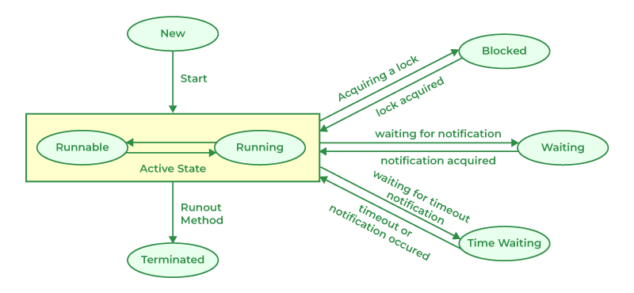

>A Java thread is the smallest unit of execution within a program

>It is a lightweight subprocess that runs independently but shares the same memory space as the process, allowing multiple tasks to execute concurrently.

>threads can be used for both concurrency and parallelism

>Concurrency: Multiple tasks make progress during the same period of time. Tasks may take turns running on a single CPU core.

>Parallelism: Multiple tasks literally run at the same instant on different CPU cores.

>

```txt
High Memory Address
+----------------------+
|        STACK         |
|      grows ↓         |
+----------------------+
|                      |
|      Free Space      |
|                      |
+----------------------+
|         HEAP         |
|      grows ↑         |
+----------------------+
|     Global/Data      |
+----------------------+
|      Code/Text       |
+----------------------+
Low Memory Address
```
